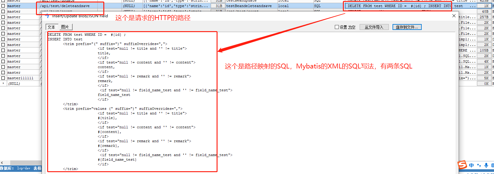
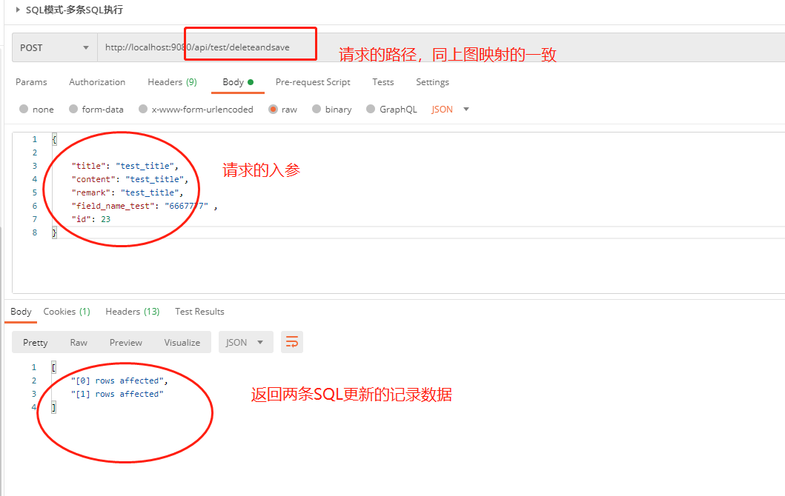
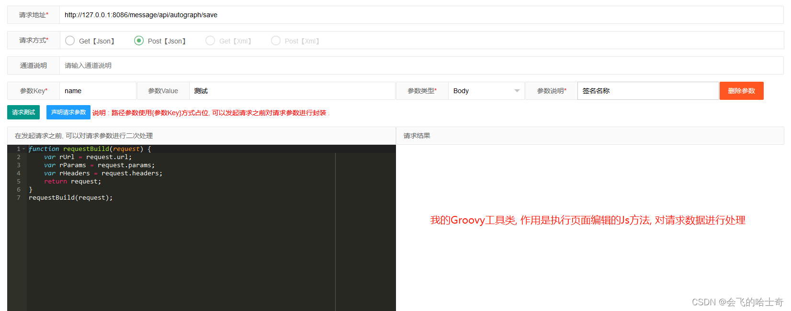
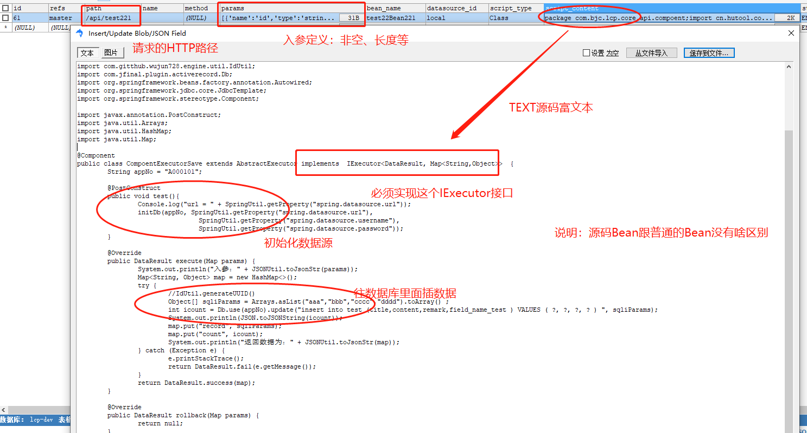
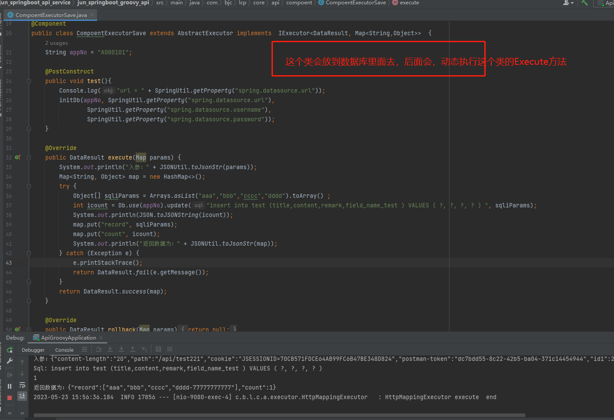
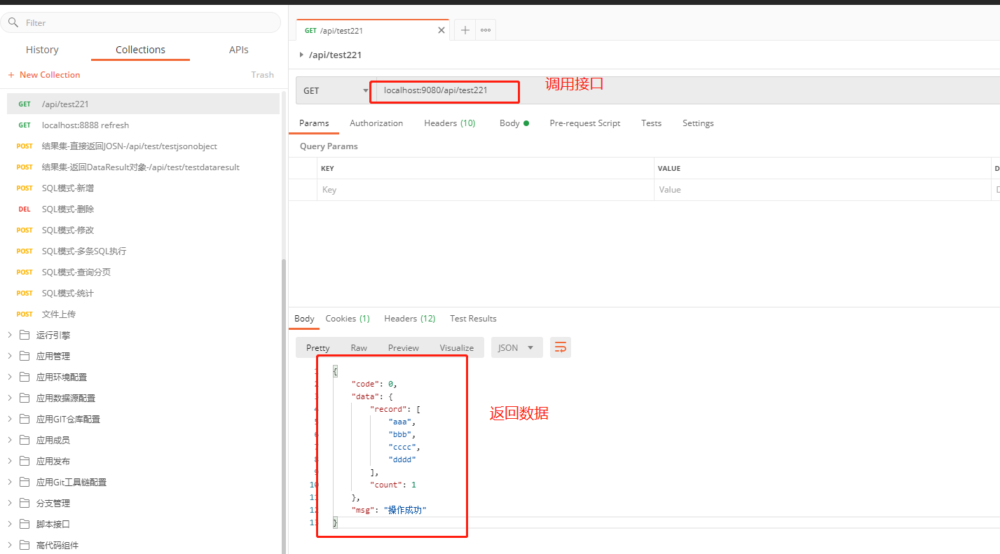
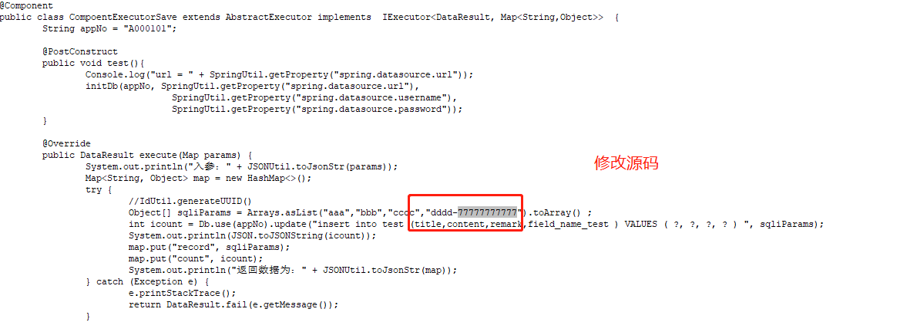
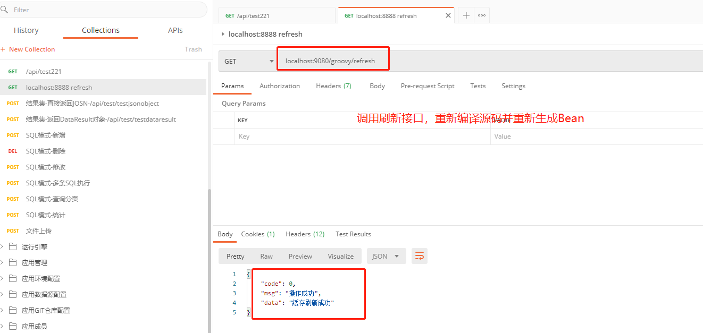
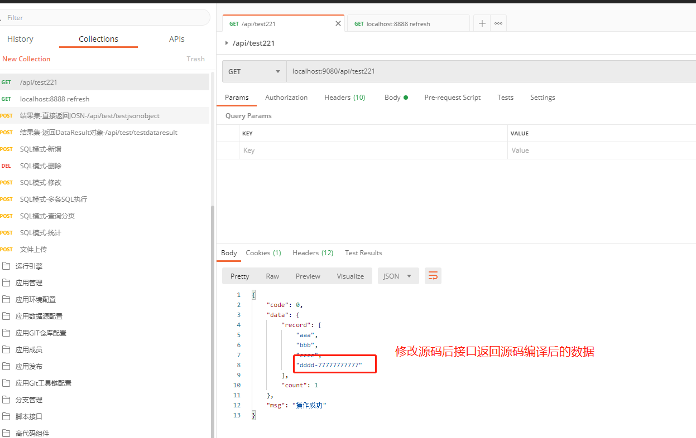

# jun_api_service

jun_springboot_api_service是一个基于我另外一个自定义的starter的动态API框架。项目本身使用技术有**SpringBoot+字节码生成执行+动态脚本+动态SQL**，**可以实时动态生成RESTAPI并动态发布或者热加载**。且发布后**可动态执行java源码、groovy脚本及SQL脚本的API服务项目**。提供在线执行动态程序脚热加载本及动态生成API并执行的功能。支持动态注册RequestMapping，动态生成类及源码并动态编译生成类并注入Spring容器生成Bean，可动态生成HTTP接口。支持在线编辑写好SQL或者Java源码、Groovy源码、Python源码（TODO），JavaScript源码（TODO）、Shell脚本，后即可快速生成Rest接口对外提供服务，同时支持服务在线热加载在线编辑替换逻辑，提供了一键生成CRUD通用接口方法，减少通用接口的SQL编写，让开发人员专注更复杂的业务逻辑实现。

说明：目前没有前端页面，都是Postman调用生成的，准备适当新增部分前端页面功能。

- 常规写项目的逻辑，硬编码MVC三层代码提供REST服务，每次调试及编码修改后重启JVM，上线后有Bug，换包重启JVM才能修复Bug。
- 针对以上，有痛点三，1、硬编码；2、重启JVM；3、换包；4、快速开发快速迭代；
  本项目如何解决以上三点：
- 解决痛点1，本项目在线执行动态Java源码程序热加载及动态生成API并执行的功能。支持动态注册RequestMapping，动态生成类及源码并动态编译生成类嵌入Spring容器生成Bean，可动态生成HTTP接口。
- 解决痛点2，无需重启JVM，根据源码生成的字节码在自定义Classloader工厂里面加载(类加载后其实卸载不了，但是类的加载器是可以卸载的)，外加ScriptEngine可动态执行Groovy脚本及JavaScript等等类型的脚本
- 解决痛点3，无需换包，源码直接存在数据库中，可动态热加载到JVM，随时编辑，随时生效；
- 解决痛点4，新增API+SQL模式，写一个path路径，写一条SQL，自动生成一个API，秒实现需求（可执行多条SQL，非复杂功能无需代码实现）。

### 特征&提供

**1、可在线写Java、编译Java源码生成字节码、生成对象、动态注册Bean实例；**

**2、可动态生成RequestMapping的Restfull接口；**

**3、可动态加载Groovy脚本源码、解析并执行Groovy源码；**

**4、支持Mybatis的XML的SQL解析，支持各种标签的SQL的解析；**

**5、无需硬编码，可实现任何硬编码实现的功能（在Jar包依赖范围内）；**

**6、动态生成代码(基于Freemarker的String模板生成StringWriter)，一键生成CRUD的代码及SQL接口，普通通用逻辑不用写代码；**

**7、如果这个项目对你有用，不妨Star一下；（没有性能问题，编译后的源码还是字节码）**


说明：本项目jun_springboot_api_service依赖本人自定义starter(jun-groovy-api-spring-boot-starter)才能运行，Starter已发布中央仓库，另源码starter也已开源。

The project is based on SpringBoot+Groovy to dynamically generate APIs and publish them, and can dynamically execute Groovy scripts and SQL scripts' Staters after publication. Provide online execution of dynamic scripts class and hot loader and dynamic API generation and execution functions.


# 使用教程

- 在自己的maven项目中**引入maven坐标（已发布中央仓库）**
```xml
<dependency>
    <groupId>io.github.wujun728</groupId>
    <artifactId>jun-groovy-api-spring-boot-starter</artifactId>
  <version>1.0.9</version>
</dependency>
```
- 参考jun_springboot_api_service中jun_springboot_groovy_api项目嵌入模块

- 在数据库新建表api_config

- 在表中新增数据，有path请求路径及script_content请求内容字段必填，脚本有SQL脚本及Class脚本

- 启动项目，或者调用refresh接口刷新缓存，在上面表中的path路径会注册到springmvc中，SQL脚本会执行，Class脚本会生成bean

- 综上，就是往api_config表里面插入数据就可以了，具体见jun_springboot_groovy_api功能模块，路径跟代码及SQL都可以执行成功。


# 核心api说明


- 核心api - **Step1-加载源码生成类及SpringBean**
```
Class clazz = groovyClassLoader.parseClass(groovyInfo.getGroovyContent());
BeanDefinitionBuilder builder = BeanDefinitionBuilder.genericBeanDefinition(clazz);
BeanDefinition beanDefinition = builder.getBeanDefinition();
registry.registerBeanDefinition(groovyInfo.getBeanName(), beanDefinition);
```

- 核心api - **Step2-动态生成SpringMapping映射HTTP服务及接口（无需手写Mapping接口）,根据SpringMVC提供的RequestMappingHandlerMapping.registerMapping来动态注册服务（文件上传下载及富表单也没问题）**
```
// 取消历史注册
requestMappingHandlerMapping.unregisterMapping(mappingInfo);
// 重新注册mapping
requestMappingHandlerMapping.registerMapping(mappingInfo, mappingFactory, targetMethod);
```


- 核心api - **Step3-执行分N种实现，目前实现三种；SQL脚本模式、Java源码模式、Groovy源码**
Python源码（TODO），NodeJS源码（TODO），Shell(TODO)、PHP(TODO)、PowerShell(TODO)等类型脚本(JVM支持的都可以支持), 具体见注入mapping的method方法；
```
// 源码解析并执行
switch (config.getScriptType()) {
case "SQL":
	data = doSQLProcess(config, request, response);
	break;
case "Class":
	data = doGroovyProcess(config, request, response);
	break;
case "Groovy": 
	data = doGroovyProcess(config, request, response);
	break;
case "Jython": // TODO
	data = doPythonProcess(config, request, response);
	break; // TODO
case "Javascript": // TODO
	data = doNodeJSProcess(config, request, response);
case "Jruby":// TODO
	data = doRubyProcess(config, request, response);
	break;
default:
	break;
}

// SQL源码执行（SQL脚本支持mybatis写法及原生写法）
SqlMeta sqlMeta = JdbcUtil.getEngine().parse(apiSql.getSqlText(), sqlParam); 
Object data = JdbcUtil.executeSql(connection, sqlMeta.getSql(), sqlMeta.getJdbcParamValues());
dataList.add(data);

// Java源码执行（实现IExecutor接口，支持定制不同的接口，一般情况下也够用了）
String beanName = GroovyInnerCache.getByPath(config.getPath());//请求Path映射Bean名称
Map<String, Object> params = getParams(request, config);//获取Request参数转Map
IExecutor bean = SpringUtil.getBean(beanName);//调用Bean
return bean.execute(params);//返回Bean结果集

//其他源码执行（使用ScriptEngineManager来执行），举例JS如下，其他的还没来得及整,TODO中
ScriptEngineManager manager = new ScriptEngineManager();
ScriptEngine engine = manager.getEngineByName("javascript");
//向engine中存值
engine.put("str", "jsEnginePutTest");
engine.eval("var output ='' ;for (i = 0; i <= str.length; i++) {  output = str.charAt(i) + output }");     

```

# 示例

**Step1-启动的时候会读取api_config表中的记录并注册为Bean**

```

开始解析groovy脚本...
c.g.w.e.g.core.bean.GroovyDynamicLoader  : 当前groovyInfo加载完成,className-testdataresult,path-/api/test/testdataresult,beanName-testdataresult,BeanType-Class：
c.g.w.e.g.core.bean.GroovyDynamicLoader  : 当前groovyInfo加载完成,className-test22Bean1,path-/mobile/api/test22,beanName-test22Bean1,BeanType-Class：
结束解析groovy脚本...，耗时：1398

```

- **Step2，择取上面启动的两个示例：SQL示例（api_config里面插一条SQL类型的接口数据就可以了）**
### SQL开发及定义

**Step1，在数据库新增SQL接口**



**Step2，执行SQL接口**



**Step3、在线编辑接口及测试接口（TODO）**



#### Java源码接口开发

**Step1，在API_CONFIG表中新增一条数据映射成下面的类的解析，SQLyog数据及类的源码展示，具体如下**


这个是接口执行类的源码：


**Step2，在POSTMAN中通过PATH，调用这个类，并Java源码解析后执行结果集返回的数据**



**Step3，不重启JVM，手动修改源码**（即使修改幅度非常大也没问题，只要能编译成功就可以）



**Step4，调用缓存刷新Refresh接口，重新初始化Bean及缓存**



**Step5，在POSTMAN中通过PATH，再次调用这个类，执行结果集返回的数据是最新编译的**


