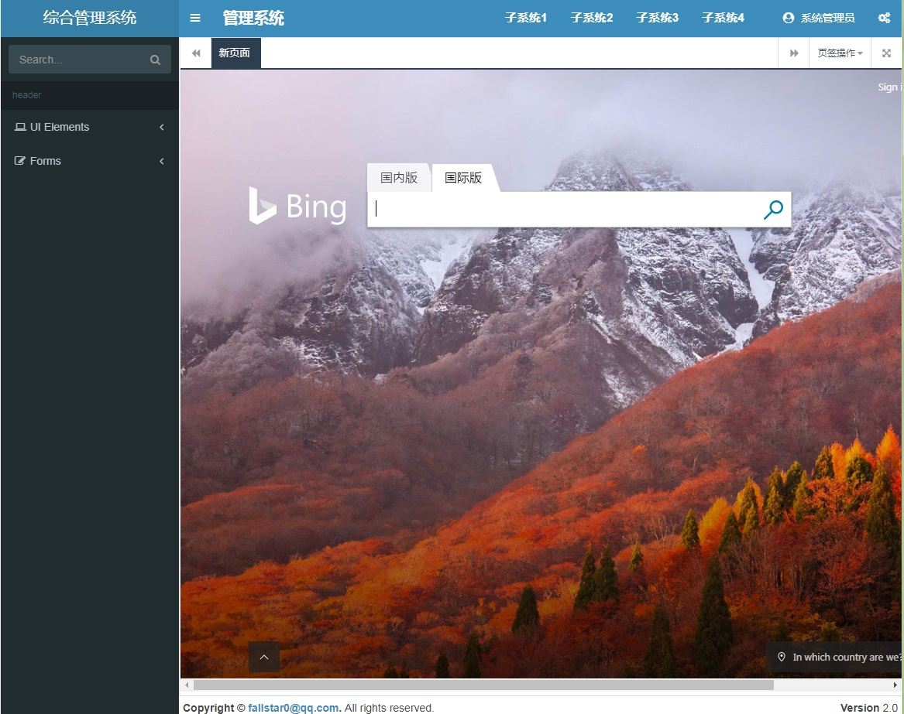
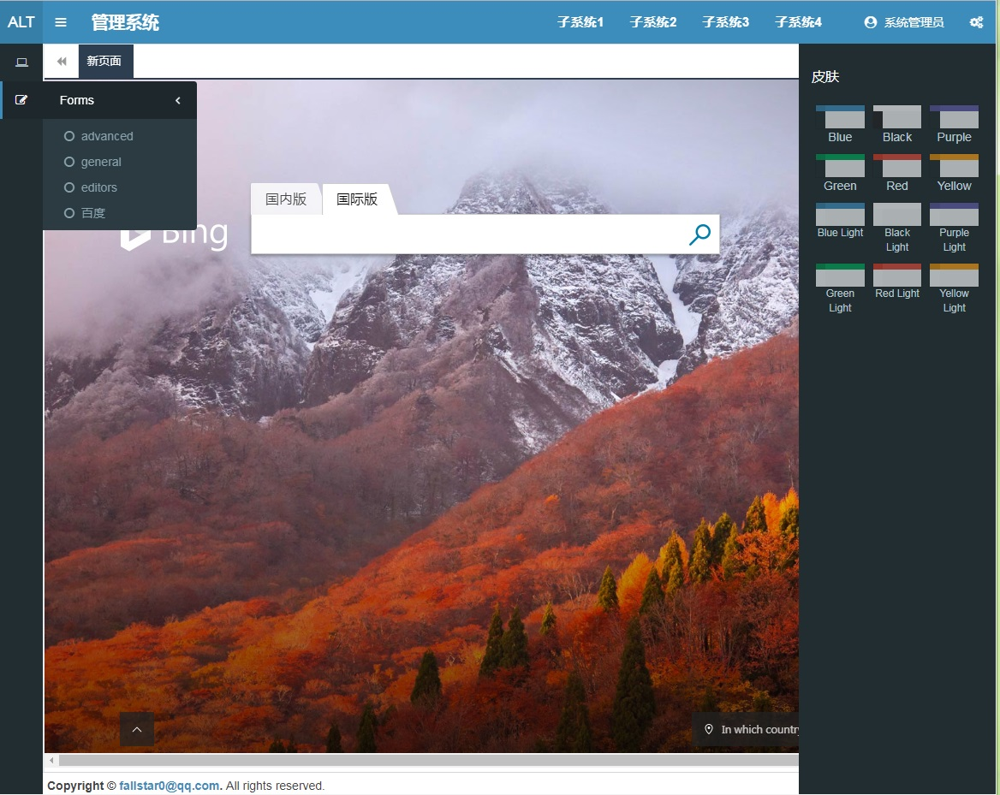

# AdminLTE-With-Iframe-Simple

本项目地址   
 [https://gitee.com/fallstar/AdminLTE-With-Iframe-Simple](https://gitee.com/fallstar/AdminLTE-With-Iframe-Simple)   

[https://github.com/FallStar0/AdminLTE-With-Iframe-Simple](https://github.com/FallStar0/AdminLTE-With-Iframe-Simple)

[English Version](README.md)

适用与那些不想适用复杂前后端分离的开发者，或者人手不够的情况。

## 项目介绍

项目完整版来源于这个项目：

[https://gitee.com/weituotian/AdminLTE-With-Iframe](https://gitee.com/weituotian/AdminLTE-With-Iframe "AdminLTE-With-Iframe")

不过这个项目依赖项目太多了，所以我精简了一下。

一个精简到只剩下外层框架的AdminLTE并使用多个标签内嵌iframe。

仅仅保留了外层框架，更换皮肤等功能。

## 功能介绍

+ 通过传入 菜单树状配置实体 组建菜单。
+ 菜单可以是虚拟的、外部链接、内部链接等
+ 提供多标签支持

## 适用场景

 Asp.net 或者 Asp.net core 的后台项目，只需要配置菜单，或者经过权限接口得到菜单之后绑定即可，然后里面的其它功能都分别开发就好了。

 配合 vue.js / jQuery / Layer 等就可以了，后端人员只需要少量简单的组合就可以成为一个系统。


## 截图




## 补充
关于如何在子页面打开新窗口：
```
//在子页面引入下面的js，这个包含了 添加、关闭、刷新 方法，你可以自行拓展它
tab.util.js

调用方法：
//打开外网地址
Util.addTab('https://baidu.com','baidu','百度',true});
//打开相对地址
Util.addTab('/test/404.html','404','404感受一下'});
//关闭当前子页面
Util.closeTab();
```