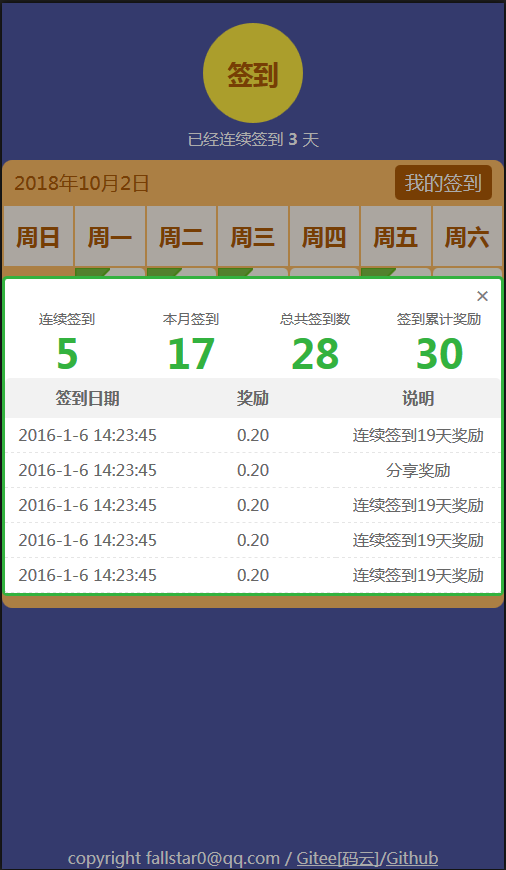

# SignSample

## Introduce(介绍)
用户签到的H5例子（css+jquery，无图片），由于网上找的的用户签到例子都不好，要不就是好多图片组成的，要不就大量冗余代码，所以特意做了个签到界面（移动端）。

User sign sample page for mobile using h5  which only use css + jquery + html.

Demo   
[https://fallstar0.github.io/SignSample/](https://fallstar0.github.io/SignSample/ "Demo")

## Shot(截图)

## Copyright
Author fallstar0@qq.com   

[https://github.com/FallStar0/SignSample](https://github.com/FallStar0/SignSample)   

[https://gitee.com/fallstar/SignSample](https://gitee.com/fallstar/SignSample)