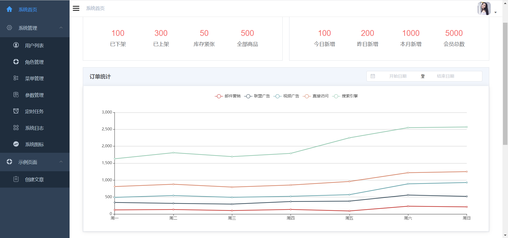

### jun_springboot_admin_vue + jun_uniapp

uniapp 编写的多端帖子系统，可以登录查看点赞等，miniDemo，后台管理使用 ruoyi

# element-shiro

#### 项目介绍
element-shiro轻量级脚手架,基于element ui、springboot、shiro、 mybatis plus、redis、mysql、maven实现.

#### 快速开始

1. 创建数据库,导入resource/sql/element-shiro.sql
2. 导入项目, 修改相关配置, 启动项目
3. 访问http://ip:port, 账号/密码:admin/admin123

### 在线体验

演示地址：http://hongtech.xyz/shiro-new/#/login  账号密码：admin/admin123

#### 运行截图

<table>
    <tr>
        <td></td>
        <td></td>
    </tr>
    <tr>
        <td></td>
        <td></td>
    </tr>
    <tr>
        <td></td>
        <td></td>
    </tr>	 
</table>